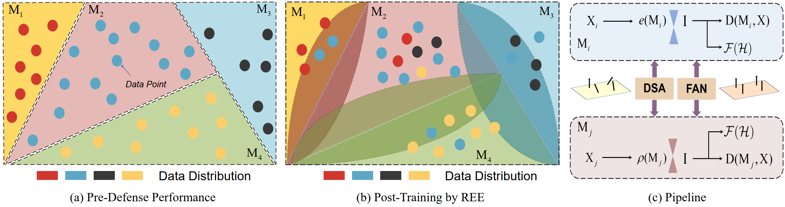
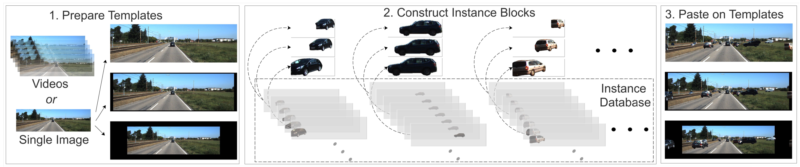
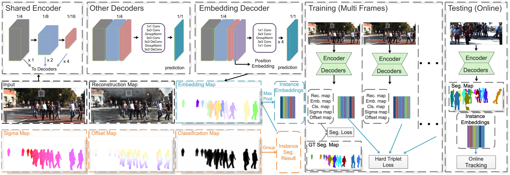
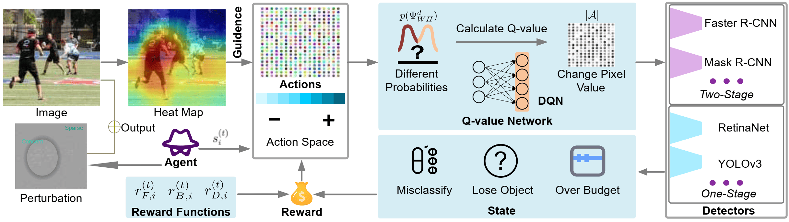
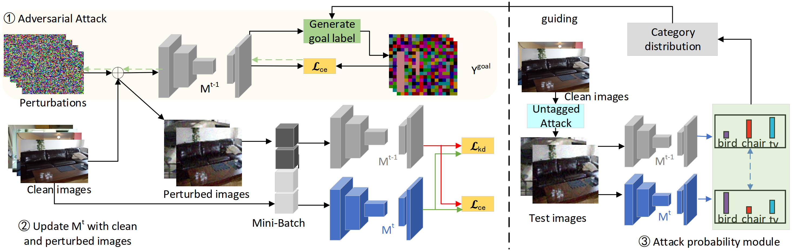
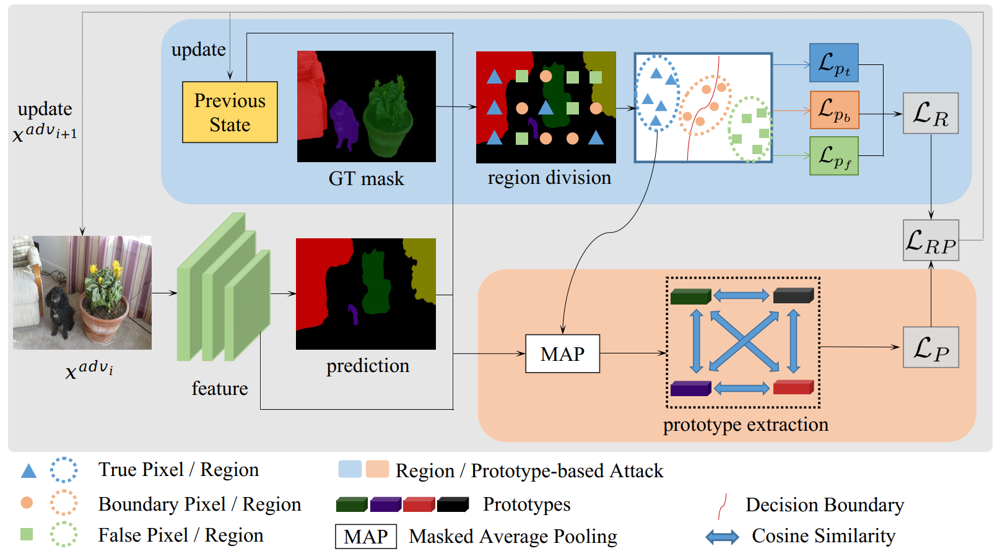

# ⛹️ Personal Profile
👔 Research Associate Professor, School of Computer Science and Technology, University of Science and Technology of China

The main research directions of our group include the foundational theory and architecture of large models, AI for Science, and computer vision.
Currently, my research group consists of postdoctoral researchers, doctoral students, and master’s students.
If you are passionate about exploration, you are welcome to join my research team, and we will make new discoveries together.
My life motto: Life lies in exploration and reflection.

**E-mail**: zbshi@ustc.edu.cn

**Course**: Quantum Computing and Machine Learning
 
**Office Location**: Science and Technology Laboratory Building, West District, USTC (科大西区科技实验楼西楼)

# 💡 Research Directions
- Foundational Theory and Architecture of Large Models
- AI for Science
- Computer Vision

# 🔥 Selected News
- *2025.9*: One paper has been accepted by NeurIPS 2025.
- *2025.7*: One paper has been accepted by TDSC.
- *2024.12*: Three papers have been accepted by AAAI 2025.
- *2024.10*: Selected as representative of BRICS Young Scientists.
- *2024.07*: One paper has been accepted by ACM MM 2024.
- *2024.04*: One paper has been accepted by IJCAI 2024.
- *2023.12*: Two papers have been accepted by AAAI 2024.
- *2023.12*: Invited as the reviewer of CVPR 2024.
- *2023.07*: One paper has been accepted by ACM MM 2023.
- *2021.07*: One paper has been accepted by ICCV 2021.

# 📝 Selected Publications 

- Yuxuan Zhang, **Zhenbo Shi***, Han ye, Shuchang Wang, Zhidong Yu, Shaowei Wang, Wei Yang. "Leaving No OOD Instance Behind: Instance-Level OOD Fine-Tuning for Anomaly Segmentation". in 2025 Annual Conference on Neural Information Processing Systems. (**CCF A**🎉)
- Zhidong Yu, Xiaoman Liu, Jiajun Hu, **Zhenbo Shi***, Wei Yang. "AAKR: Adversarial Attack-based Knowledge Retention for Continual Semantic Segmentation". in 2025 Proceedings of the AAAI Conference on Artificial Intelligence. (**CCF A**🎉)
- Yuxuan Zhang, **Zhenbo Shi***, Shuchang Wang, Wei Yang, Shaowei Wang, Yinxing Xue. "RP-PGD: Boosting Segmentation Robustness with a Region-and-Prototype Based Adversarial Attack". in 2025 Proceedings of the AAAI Conference on Artificial Intelligence. (**CCF A**🎉)
- **Zhenbo Shi**, Zhidong Yu, Yuxuan Zhang, Wei Yang, Liusheng Huang. "A Unified Perspective from Diffuse Deviation to Target Hijacking". in IEEE Transactions on Dependable and Secure Computing. (**CCF A**🎉)
- **Zhenbo Shi**, Xiaoman Liu, Yuxuan Zhang, Shuchang Wang, Rui Shu, Zhidong Yu, Wei Yang, Liusheng Huang. "Stop Diverse OOD Attacks: Knowledge Ensemble for Reliable Defense". in 2025 Proceedings of the AAAI Conference on Artificial Intelligence. (**CCF A**🎉)
- **Zhenbo Shi**, Zhidong Yu, Yuxuan Zhang, Shuchang Wang, Xiaoman Liu, Wei Yang, Liusheng Huang. "Tip the Scales: Achieving Balance in Adversarial Examples Across Modalities". in 2025 IEEE International Conference on Acoustics, Speech and Signal Processing. (**CCF B**🎉)
- Zhidong Yu, **Zhenbo Shi***, Xiaoman Liu, Wei Yang. "PFFAA: Prototype-based Feature and Frequency Alteration Attack for Semantic Segmentation". in 2024 ACM International Conference on Multimedia. (**CCF A**🎉)
- Yuxuan Zhang, **Zhenbo Shi**, Wei Yang, Shuchang Wang, Shaowei Wang, Yinxing Xue. "GenSeg: On Generating Unified Adversary for Segmentation". in 2024 International Joint Conference on Artificial Intelligence. (**CCF A**🎉)
- Zhidong Yu, Wei Yang, Xike Xie, **Zhenbo Shi**. "Attacks on Continual Semantic Segmentation by Perturbing Incremental Samples". in 2024 Proceedings of the AAAI Conference on Artificial Intelligence. (**CCF A**🎉)
- Zhidong Yu, Wei Yang, Xike Xie, **Zhenbo Shi**. "TIKP: Text-to-Image Knowledge Preservation for Continual Semantic Segmentation". in 2024 Proceedings of the AAAI Conference on Artificial Intelligence. (**CCF A**🎉)
- **Zhenbo Shi**, Wei Yang, Zhenbo Xu, Zhidong Yu, Liusheng Huang. "Reinforcement Learning-based Adversarial Attacks on Object Detectors using Reward Shaping". in 2023 ACM International Conference on Multimedia. (**CCF A**🎉)
- **Zhenbo Shi**, Zhi Chen, Zhenbo Xu, Wei Yang, Liusheng Huang. "AtHom: Two Divergent Attentions Stimulated By Homomorphic Training in Text-to-Image Synthesis". in 2022 ACM International Conference on Multimedia. (**CCF A**🎉)
- **Zhenbo Shi**, Zhi Chen, Zhenbo Xu, Wei Yang, Zhidong Yu, Liusheng Huang."Shape Prior Guided Attack: Sparser Perturbations on 3D Point Clouds". in 2022 Proceedings of the AAAI Conference on Artificial Intelligence. (**CCF A**🎉)
- Zhenbo Xu, Ajin Meng, **Zhenbo Shi**, Wei Yang, Zhi Chen, Liusheng Huang. "Continuous Copy-Paste for One-stage Multi-object Tracking and Segmentation". in 2021 IEEE International Conference on Computer Vision. (**CCF A**🎉)
- Zhi Chen, Xiaoqing Ye, Liang Du, Wei Yang, Liusheng Huang, Xiao Tan, **Zhenbo Shi**, Fumin Shen, Errui Ding. "AggNet for Self-supervised Monocular Depth Estimation: Go An Aggressive Step Further". in 2021 ACM International Conference on Multimedia. (**CCF A**🎉)
- **Zhenbo Shi**, Wei Yang, Zhenbo Xu, Zhi Chen, Yingjie Li, Haoran Zhu, Liusheng Huang. "Adversarial Attacks On Object Detectors With Limited Perturbations". in 2021 IEEE International Conference on Acoustics, Speech and Signal Processing. (**CCF B**🎉)
- Zhi Chen, Wei Yang, Zhenbo Xu, **Zhenbo Shi**, Liusheng Huang. "VK-Net: Category-level Point Cloud Registration with Unsupervised Rotation Invariant Keypoints". in 2021 IEEE International Conference on Acoustics, Speech and Signal Processing. (**CCF B**🎉)
- Yuxuan Zhang, Shuchang Wang, **Zhenbo Shi**, Wei Yang. "On Filling the Intra-class and Inter-class Gaps for Few-shot Segmentation". Expert Systems with Applications. (Zone 1🎉)
- Yingjie Li, Wei Yang, Zhenbo Xu, Zhi Chen, **Zhenbo Shi**, Yi Zhang, Liusheng Huang. "Mask4d: 4D Convolution Network for Light Field Occlusion Removal". in 2021 IEEE International Conference on Acoustics, Speech and Signal Processing. (**CCF B**🎉)
- Huichao Wang, Wei Yang, Bangzhou Xin, Yangyang Geng, **Zhenbo Shi**, Liusheng Huang. "Private FLI: Anti-Gradient Leakage Recovery Data Privacy Architecture". in 2021 International Joint Conference on Neural Networks.

# 🎖 Honors
- Asia-Pacific AI Education Outstanding Young Scholar
- CCF-Baidu Open Fund Scholar
- Mozi special allowance for outstanding youth.(墨子杰出青年)
- A Representative of the BRICS Young Scientists (One of 12 National Representatives).(金砖国家青年科学家代表)
- Excellent Project Award of the Central Cyberspace Affairs Commission Innovation Program (1%).
- Selected into the Xiaomi Young Talents Program.(小米青年学者)

# 💡 Projects
-  National Natural Science Foundation of China (T Department Comprehensive Research Special Project) (主持)
-  CCF-Baidu Open Fund (主持)
-  Youth Innovation Fund of University of Science and Technology of China (主持)
-  Natural Science Foundation of Jiangsu Province (主持)
-  Laboratory for Advanced Computing and Intelligence Engineering Fund (主持)
-  Central Cyberspace Administration Innovation Plan Project (主持)
-  ......

# 💬 Invited Talks
- *2024.11*, Invited to deliver a keynote speech on the security of multimodal models at the BRICS Young Scientists Forum (Sochi, Russia). 
- *2023.05*, Invited to deliver a keynote report at the first Cybersecurity Innovation Forum (Wuhan, China).

# 💡 Recent Works
<figure>
  
  <figcaption style="text-align: center; font-weight: bold;">REE</figcaption>
</figure>

<figure>
  
  <figcaption style="text-align: center; font-weight: bold;">CCP</figcaption>
</figure>

<figure>
  
  <figcaption style="text-align: center; font-weight: bold;">CCPNet</figcaption>
</figure>

<figure>
  
  <figcaption style="text-align: center; font-weight: bold;">IRSA</figcaption>
</figure>

<figure>
  
  <figcaption style="text-align: center; font-weight: bold;">AAKR</figcaption>
</figure>

<figure>
  
  <figcaption style="text-align: center; font-weight: bold;">RP-PGD</figcaption>
</figure>

# 💻 Services
- *ICLR 2025*, Reviewer.
- *ICML 2025*, Reviewer.
- *CVPR 2025*, Reviewer.
- *NeurIPS 2024*, Reviewer.
- *ACM MM 2024*, Reviewer.
- *ECCV 2024*, Reviewer.
- *CVPR 2024*, Reviewer.
- *AAAI 2024*, Reviewer.
- *ICCV 2023*, Reviewer.
- *AAAI 2023*, Reviewer.
- *ICASSP 2023*, Reviewer.
- *ECCV 2022*, Reviewer.
- *ICASSP 2022*, Reviewer.

